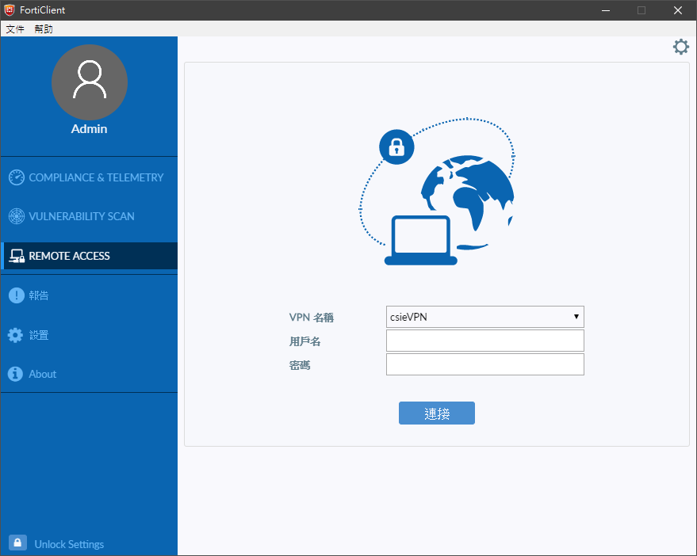

title: VPN2 FortiClient 使用說明
---
## 規範
<blockquote>本系 VPN 服務僅提供系上師生進行相關文獻閱覽或在校相關服務使用

由於服務性質因素，若有同學使用 VPN 進行對外攻擊或是大量下載之相關違規事項

經查詢屬實，將停止同學系上帳號及工作站使用權力，還請同學切勿以身試法。
</blockquote>

## FortiClient VPN連線步驟
### 1. 進入以下網址下載並安裝forticlient

https://www.forticlient.com/downloads
依自己的需求選擇對應的版本安裝

### 2.執行FortiClient
選擇REMOTE ACCESS

### 3. 右上角選擇建立新連接

### 4. 設定完後保存
連接名及描述隨意
遠程網關輸入 vpn2.cs.ccu.edu.tw
自定義端口輸入 8443

### 5. 使用工作站帳號密碼後即可連接vpn

### 6. 出現此視窗即為連線成功

