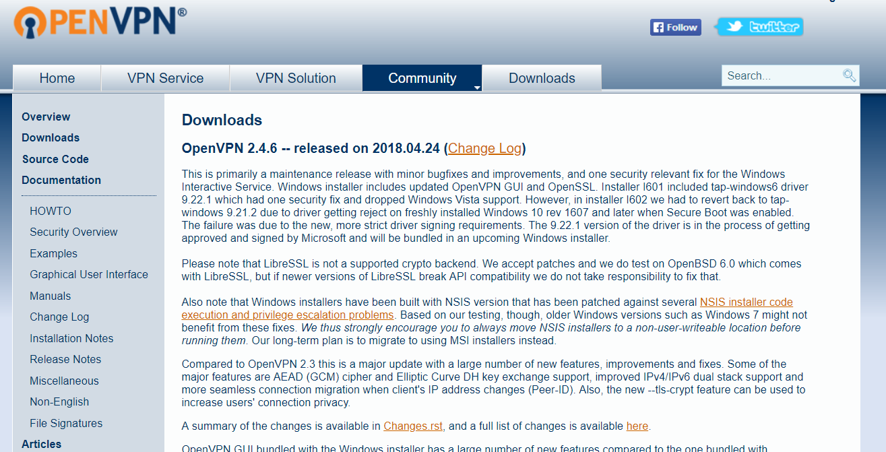
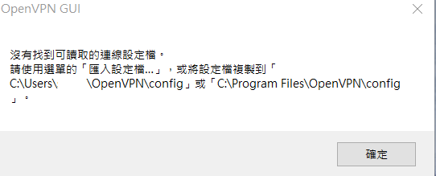
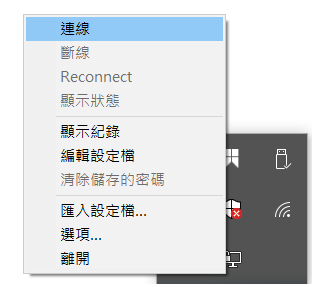
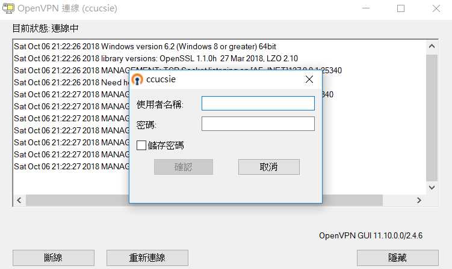
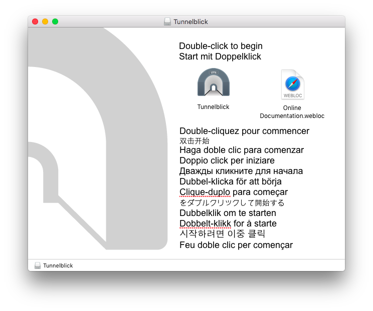
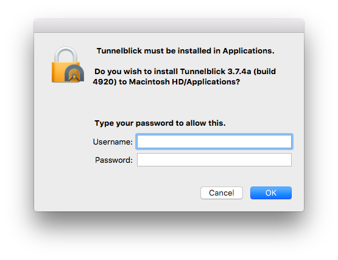
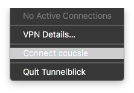

title: VPN 使用手冊
---
## 規範
<blockquote>本系 VPN 服務僅提供系上師生進行相關文獻閱覽或在校相關服務使用

由於服務性質因素，若有同學使用 VPN 進行對外攻擊或是大量下載之相關違規事項

經查詢屬實，將停止同學系上帳號及工作站使用權力，還請同學切勿以身試法。
</blockquote>

## OpenVPN

### Windows

0. 前往 [OpenVPN 官網下載處](https://openvpn.net/index.php/open-source/downloads.html)。 下載對應客戶端並安裝。



1. 前往 [vpn.cs](https://vpn.cs.ccu.edu.tw)。下載 [OpenVPN 設定檔](https://vpn.cs.ccu.edu.tw/clients/ccucsie.ovpn)

2. 執行已安裝完成之 OpenVPN GUI, 此時應會出現要求設定檔之提示



3. 右鍵點擊右下角 OpenVPN GUI 圖示，點選匯入設定檔選項, 選擇並匯入前述下載之設定檔


4. 再次右鍵點擊 OpenVPN GUI 圖示, 點選連線選項



5. 輸入系上工作站帳號密碼登入



6. 當看到訊息 "已連線至 ccucsie", 即表示 VPN 連線已完成


### MacOS

本教學包含兩部分，請依喜好擇一選用。
* [Tunnelblick](#tunnelblick) ...for beginner
* [Terminal](#terminal) ...for advanced user ~~and good CS student~~

#### Tunnelblick

0. 前往 [Tunnelblick 官網](https://tunnelblick.net)。 點擊左側綠色箭號 "Download Latest Stable Release"。


1. 當警示視窗跳出，點擊 "Open"。


2. 打開所下載之 dmg 檔案。雙擊 Tunnelblick 圖示。


3. 輸入 mac 使用者帳號及密碼以允許安裝。


4. 安裝完成後，將 [中正資工 VPN 設定檔](https://vpn.cs.ccu.edu.tw/clients/ccucsie.ovpn) 拖曳到左側 Configuration 欄內。


5. 點選上圖右下方之 "Connect"，或是點選 Spotlight 旁之 Tunnelblick 圖示（如下圖），並點選 "Connect ccucsie"。



6. 以中正資工系工作站帳號及密碼登入。


7. 看到訊息 "ccucsie Connected" 表示 VPN 連線已完成。


#### Terminal

0. 安裝套件管理工具 [Homebrew](https://brew.sh)。
Install package management tool [Homebrew](https://brew.sh).
```
$ /usr/bin/ruby -e "$(curl -fsSL https://raw.githubusercontent.com/Homebrew/install/master/install)"
```
> Q: What does homebrew do?
> A: Homebrew installs the stuff you need that Apple didn’t.[name=#homebrew][color=brown]

1. 以 Homebrew 安裝 OpenVPN。
```
$ brew install openvpn
```

2. 因 `openvpn` 置於 `/usr/local/sbin/` 下，而該路徑原生不在 `PATH` 中，故將下行加入 `~/.bashrc` 中，並重新 `source ~/.bashrc`。
```
export PATH=/usr/local/sbin:$PATH
```

3. 以 `openvpn` 進行連線。（[OpenVPN 設定檔下載](https://vpn.cs.ccu.edu.tw/clients/ccucsie.ovpn)）
```
$ sudo openvpn /path/to/config/ccucsie.ovpn
```

4. 看到訊息 "Initialization Sequence Completed" 表示 VPN 連線已完成。
```
Sun Nov 12 11:17:53 2017 Initialization Sequence Completed
```

5. （選擇性）因密碼可能會快取於記憶體中，請考慮使用參數 `auth-nocache` 以提升安全性。
```
WARNING: this configuration may cache passwords in memory -- use the auth-nocache option to prevent this
```

## Notice
如果 log 出現以下訊息而無法連線
```
OpenSSL: error:0A000086:SSL routines::certificate verify failed:
TLS_ERROR: BIO read tls_read_plaintext error
TLS Error: TLS object -> incoming plaintext read error
TLS Error: TLS handshake failed
``` 
這是因為我們這邊使用版本比較舊，會導致舊版加密協議被新版 openvpn client 阻擋，
預計在這兩個月會更新 vpn 設定檔，到時會再發公告並需要至網頁下載新檔案，
目前先提供給您暫時的解決方法：


* 在指令下新增參數降低安全等級
```openvpn --config ccucsie.ovpn --tls-cipher DEFAULT:@SECLEVEL=0``` <br>
* 在設定檔最下面加上
```tls-cipher "DEFAULT:@SECLEVEL=0"``` <br>

如果您是使用其他客戶端工具，請至設定更改相關設置，或降低版本，並注意這樣的做法僅為暫時用。

## Bug Report

若使用上有問題，請聯繫資工系計中信箱。
- [About US](/about/)

